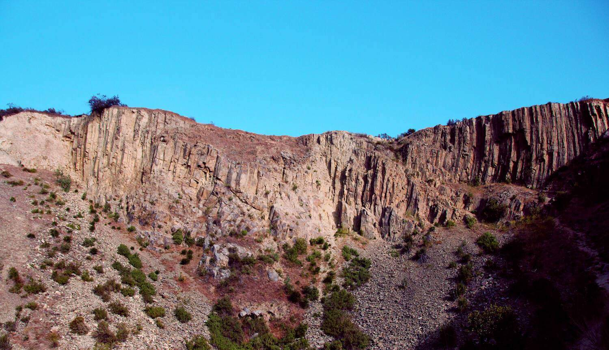

# Aaron McCully

## Pursing a Bachelor of Science degree in computer science

---

### Navigation:

* [My github page](https://github.com/amccully?tab=repositories), which includes some of the projects I've worked on at community college and UCSD.

* To read a little bit about me, [click here](#summary)

* To see my computer science coursework experience so far, [click here](#coursework)

* To learn about my hobby of hiking, [click here](#hiking)

* To learn about my hobby of weight lifting, [click here](#gym)

* To clone this repository, [click here](#clone-this-repo)

---

### Summary
>I am a computer science student with over 4 years of experience in programming and college-level experience in UI/UX design. The coursework I have taken emphasizes understanding Abstract Data Types, implementing data structures in Java and C++, as well as creating digital, human-centered design products. I have collaborative experience in researching, analyzing, and improving the ease of use of existing software UIs. Eager to utilize attention to detail, I'm ready to explore and build creative solutions with an adaptive team.

---

### Coursework
This section is to give you an idea of what areas of computer science I have college-level experience in so far.

Lower-division
- [x] Objected-Oriented Programming Design (Java)
- [x] Basic Data Structures (Java)
- [x] Software Tools and Techniques
- [x] Discrete Mathematics
- [x] Mathematics for Algorithms and Systems
- [x] Computer Organization and Systems Programming

Upper-division
- [x] Advanced Data Structures (C++)
- [ ] Design and Analysis of Algorithms
- [x] Probability and Statistics
- [x] Theory of Computability
- [ ] Modern Cryptography
- [ ] Software Engineering
- [ ] Computer Networks
- [ ] Database Systems
- [ ] Digital Systems Design
- [ ] Computer Architecture
- [ ] Artificial Intelligence and Machine Learning

---

### Hiking

I find that I already spend plenty of time inside and on my computer. So when I have free time, I prefer to be active in the outdoors. One of my favorite ways of accomplishing this is going on hikes. Some of the places I would frequent the most while living at home in Oceanside were...

*Ordered from most frequented to least*

1. Calavera

*Located in Carlsbad*

2. Monserate

*Located in Fallbrook*

3. Double Peak Park

*Located in San Marcos*

---

### Gym

Being outdoors is great, but I often leave such activities for the weekend when I have ample time. However, I rely on the gym as a way of staying active and getting away from the computer on any given day. I'll try to get around an hour worth of exercise in on days that I'm not resting. I have a standard cycle that I usual follow, which includes a set of typical exercises:

1. Push day        
*Middle of the road. This can be a good day or a bad day depending on the circumstances*
   * Chest press
   * Body-weight dips
   * Shoulder press
   * Tricep extensions (or some tricep exercise)
   * Lateral raises
   * Push-ups if body permits 

2. Leg day         
*Almost always dreaded, but as necessary as any other.*
   * Squat machine or pistol squats
   * Calf raises
   * Weighted crab walks or lunges 
   * Hip abduction & adduction
   * Leg extensions
   * Any hamstring exercise if time permits

3. Pull day     
*Almost always welcome, back and biceps are king.*
   * Pull-ups (body weight or lat pull-down bar)
   * Bicep curls (heavier)
   * Seated row
   * Bicep curls (lighter variations)
   * Lat pull-down machine
   * Rear delts if time permits

4. Rest day     
*One of the most important days arguably. Make sure you still eat a good amount!*
   * Eat food
   * Do normal stuff
   * Don't go to the gym


At this point, the cycle repeats, going back to the first day.

---

### Clone this repo!

Git command for cloning this repo:
```
git clone https://github.com/amccully/cse110
```

